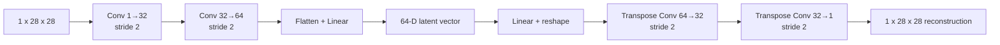

# MNIST Class-Conditional Autoencoders

A reproducible PyTorch study of convolutional autoencoders for MNIST reconstruction and
latent-space analysis. The repository supports two related experiments:

1. a **unified autoencoder** trained on all ten digits, which provides one shared latent
   coordinate system for defensible cross-class analysis; and
2. **class-conditional autoencoders** trained on one digit at a time, which test whether
   specialization improves within-class reconstruction.

This is a cleaned research implementation derived from an exploratory project. Historical
notebooks, duplicated datasets, checkpoints, and draft reports are intentionally excluded from
Git because their metrics and provenance were inconsistent. No benchmark result is claimed until
the experiments in this repository are rerun from the commands below.

## Research question

How does class-specific specialization affect reconstruction error and representation structure,
and what comparisons remain valid when separate neural networks learn different latent coordinate
systems?

The central methodological distinction is important:

- Within one encoder, PCA, t-SNE, per-class MSE, and class separation operate on a shared space.
- Across independently trained encoders, raw latent coordinates, centroids, and cosine similarity
  are not directly comparable without an explicit alignment method.

## What this repository contributes

- A compact convolutional autoencoder with an explicit 64-dimensional bottleneck.
- Preservation of MNIST's canonical 60,000/10,000 train/test partition.
- A seeded, stratified validation split created only from the training partition.
- Validation-based early stopping that restores the best checkpoint.
- Complete, sample-weighted reconstruction MSE rather than partial-batch estimates.
- Per-digit evaluation for the unified model.
- PCA and seeded t-SNE helpers for vectors produced by the same encoder.
- Tests, lint configuration, typed experiment metadata, and GitHub Actions CI.

## Architecture



## Installation

Python 3.10 or newer is required.

```bash
python -m venv .venv
source .venv/bin/activate  # Windows PowerShell: .venv\Scripts\Activate.ps1
python -m pip install --upgrade pip
python -m pip install -e ".[dev]"
```

## Reproduce the experiments

Train the unified model:

```bash
mnist-ae --output-dir artifacts/unified --epochs 50 --seed 42 --deterministic
```

Train one class-conditional model:

```bash
mnist-ae --digit 0 --output-dir artifacts/digit-0 --epochs 50 --seed 42 --deterministic
```

Run all ten class-conditional experiments in PowerShell:

```powershell
0..9 | ForEach-Object {
  mnist-ae --digit $_ --output-dir "artifacts/digit-$_" --epochs 50 --seed 42 --deterministic
}
```

Each run writes:

- `model.pt`: weights, architecture parameters, and experiment metadata;
- `metrics.json`: split sizes, best validation epoch, learning curve, and complete test MSE;
- `test_mse_by_digit`: per-class test MSE when using the unified encoder.

Generated data, checkpoints, and artifacts are ignored by Git. If checkpoints need to be shared,
publish selected files as a versioned release rather than committing every training artifact.

## Verification

```bash
ruff check .
pytest
```

The tests verify model shapes and output range, deterministic/disjoint stratified splits, and that
the MSE implementation uses every element of every batch.

## Evaluation plan

The first defensible comparison should report at least three seeds and include:

| Question | Primary evidence |
|---|---|
| Does specialization improve reconstruction? | Unified vs. class-conditional test MSE per digit, mean ± SD across seeds |
| Does the bottleneck retain digit information? | Linear probe or k-NN accuracy on frozen unified-model latents |
| Are latent neighborhoods stable? | Trustworthiness or neighbor preservation, supported—not replaced—by PCA/t-SNE |
| Is extra model capacity responsible for gains? | Parameter- or compute-matched baseline |

An even stronger study would compare against PCA, a fully connected autoencoder, and a unified
convolutional autoencoder under matched evaluation conditions.

## Limitations

- MNIST is an educational benchmark and does not establish real-world generalization.
- Reconstruction MSE does not fully reflect perceptual similarity.
- t-SNE is exploratory and sensitive to its settings; visual separation is not a quantitative
  validation of representation quality.
- Ten class-conditional models use substantially more total parameters than one unified model.
- Separate encoders require alignment or invariant representation analysis before cross-model
  latent coordinates can be compared.
- Current repository results are intentionally pending a clean multi-seed rerun.

## Project status

The reproducible scaffold and unit tests are complete. The next release milestone is a clean,
multi-seed benchmark with generated figures and a corrected research report. See
[the project audit](docs/PROJECT_AUDIT.md) for the evidence behind this decision.

## Data and references

- MNIST is downloaded through `torchvision`; the repository does not redistribute generated image
  copies or CSV conversions.
- LeCun, Bottou, Bengio, and Haffner (1998), *Gradient-Based Learning Applied to Document
  Recognition*.
- van der Maaten and Hinton (2008), *Visualizing Data using t-SNE*.
- Larsen, Sønderby, Larochelle, and Winther (2016), *Autoencoding beyond pixels using a learned
  similarity metric*.

## Authorship and license

Before making this repository public, confirm contributor names, roles, permission to publish any
jointly authored material, and the intended software license. No license is currently granted.

