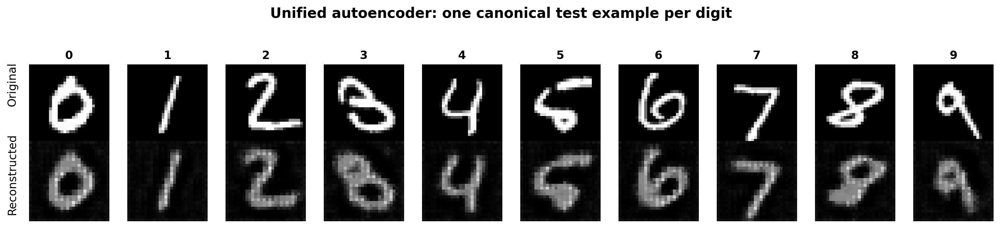
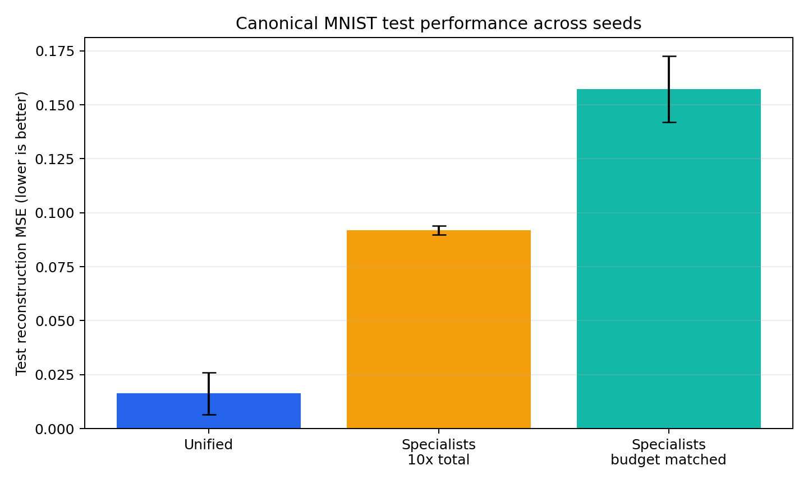
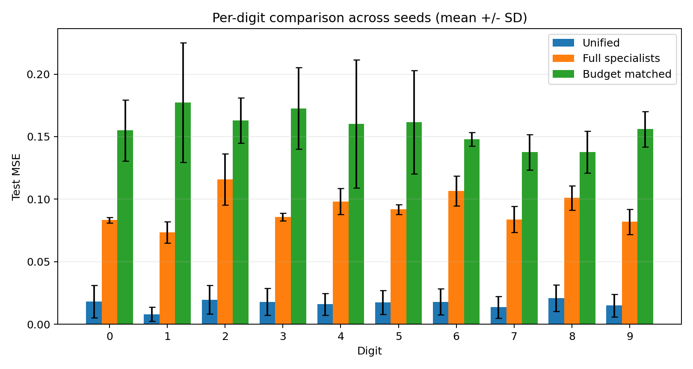
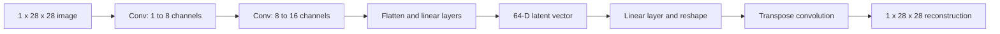

# MNIST Class-Conditional Autoencoders

[](https://github.com/Keval-7503/mnist-class-conditional-autoencoders/actions/workflows/tests.yml)
[](pyproject.toml)
[](LICENSE)

A reproducible PyTorch study testing whether ten digit-specific autoencoders reconstruct MNIST
better than one unified autoencoder. The experiment uses the canonical test partition, three fixed
seeds, paired per-image errors, a parameter-budget control, simple baselines, and a frozen-latent
linear probe.



The figure contains exactly 20 canonical test images: one original example for each digit on the
top row and its reconstruction from the seed-11 unified model on the bottom row.

## Main finding

The specialization hypothesis was not supported under the fixed 12-epoch training budget.
Neither specialist system beat the unified model in any of the three seeds, while 64-component
PCA achieved the lowest reconstruction error.

| Condition | Canonical test MSE |
|---|---:|
| 64-component PCA | **0.009089** |
| Unified autoencoder | 0.016295 +/- 0.009734 |
| Global mean image | 0.067467 |
| Ten full-size specialists | 0.091855 +/- 0.002117 |
| Ten budget-matched specialists | 0.157198 +/- 0.015268 |

Neural results are mean +/- sample standard deviation across seeds 11, 22, and 33. Lower is better.
The frozen 64-dimensional unified representation also supported **91.17% +/- 0.32%** linear-probe
test accuracy.





See the [complete results](results/RESULTS.md) and
[machine-readable benchmark](results/benchmark.json).

## Experimental design

| Component | Implementation |
|---|---|
| Dataset | MNIST canonical 60,000 train / 10,000 test partition |
| Validation | Seeded stratified split drawn only from the training partition |
| Unified condition | One convolutional autoencoder trained on all digits |
| Full specialists | Ten same-size autoencoders with oracle digit routing |
| Capacity control | Ten smaller specialists within 3% of unified total parameters |
| Replication | Seeds 11, 22, and 33; 63 neural fits in total |
| Primary metric | Complete per-pixel test MSE |
| Baselines | 64-component PCA and global mean reconstruction |
| Representation check | Linear classifier on frozen unified-model latents |

The paired comparison evaluates unified and specialist reconstructions on the same test images.
Raw per-example errors and bootstrap intervals are retained in `results/benchmark.json`.

## Model



The architecture is configurable through `AutoencoderConfig`. Separate encoders do not share an
aligned latent coordinate system, so raw cross-model latent coordinates are not compared.

## Installation

Python 3.10 or newer is required.

```bash
python -m venv .venv
source .venv/bin/activate  # Windows PowerShell: .venv\Scripts\Activate.ps1
python -m pip install --upgrade pip
python -m pip install -e ".[dev]"
```

## Run an experiment

Train the unified model:

```bash
mnist-ae --output-dir artifacts/unified --epochs 50 --seed 42 --deterministic
```

Train a specialist for one digit:

```bash
mnist-ae --digit 0 --output-dir artifacts/digit-0 --epochs 50 --seed 42 --deterministic
```

Reproduce the reported three-seed benchmark:

```bash
mnist-ae-benchmark \
  --data-dir data \
  --output-dir results \
  --seeds 11 22 33 \
  --epochs 12 \
  --patience 3 \
  --batch-size 1024
```

This command writes `results/benchmark.json`, both comparison figures, and `results/RESULTS.md`.
Downloaded data and model checkpoints remain untracked.

## Reproduce the 20-image figure

Train the reported seed-11 unified condition and render one original/reconstruction pair per digit:

```bash
mnist-ae \
  --data-dir data \
  --output-dir artifacts/visualization-seed-11 \
  --epochs 12 \
  --patience 3 \
  --batch-size 1024 \
  --seed 11 \
  --deterministic

mnist-ae-visualize \
  --checkpoint artifacts/visualization-seed-11/model.pt \
  --data-dir data \
  --output results/reconstruction_examples.png
```

## Repository structure

```text
.
|-- src/mnist_autoencoder/   # model, training, analysis, and CLIs
|-- tests/                   # unit and artifact-integrity tests
|-- results/                 # report, figures, and machine-readable evidence
|-- docs/                    # fixed protocol and data/model card
|-- .github/workflows/       # continuous integration
|-- pyproject.toml
|-- CITATION.cff
|-- LICENSE
```

## Verification

```bash
ruff check .
pytest
```

The test suite covers model shapes, deterministic stratified splits, complete MSE aggregation,
capacity matching, benchmark integrity, and reconstruction-example selection. GitHub Actions runs
the same checks on every push and pull request.

## Limitations

- MNIST is an educational benchmark and does not establish real-world generalization.
- Reconstruction MSE does not fully represent perceptual quality.
- Specialist evaluation assumes oracle access to the correct digit.
- All 63 fits reached epoch 12, so the conclusions apply to a fixed training budget rather than
  asymptotic convergence.
- Three seeds provide replication but only coarse between-run uncertainty.
- Raw coordinates from independently trained encoders require alignment before comparison.

The fixed protocol is documented in [`docs/EXPERIMENT_PROTOCOL.md`](docs/EXPERIMENT_PROTOCOL.md),
with data and model details in
[`docs/DATA_AND_MODEL_CARD.md`](docs/DATA_AND_MODEL_CARD.md).

## Author and license

Created and maintained by **Keval Dilipbhai Patel**. Citation metadata are available in
[`CITATION.cff`](CITATION.cff). The code and documentation are released under the
[MIT License](LICENSE).